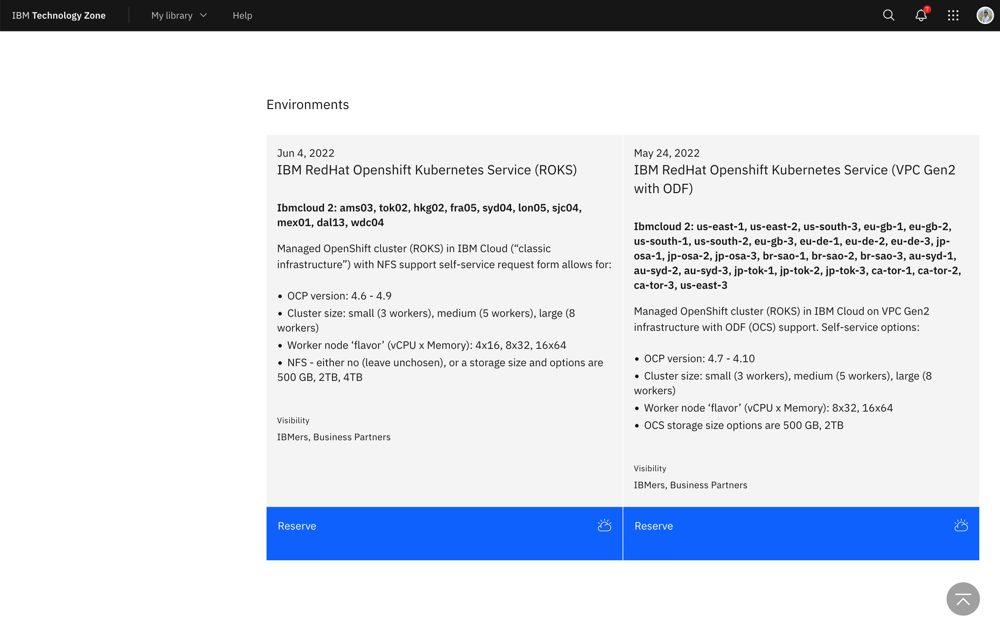
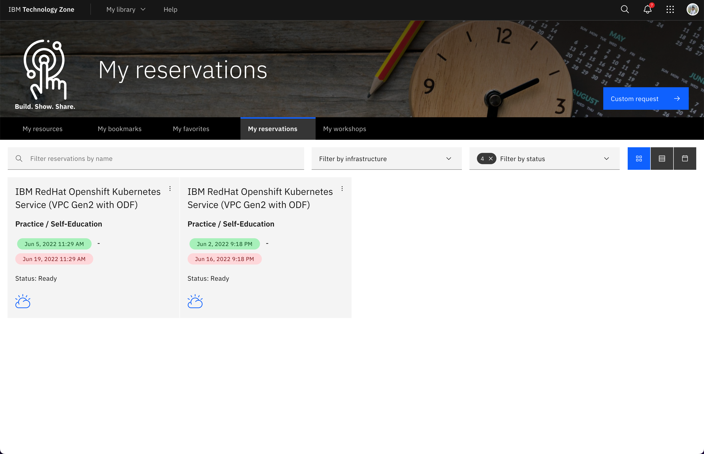
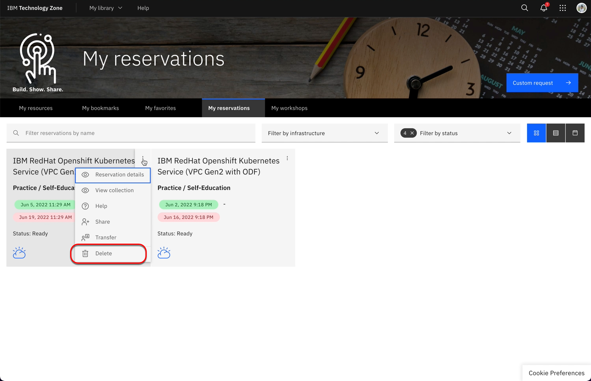
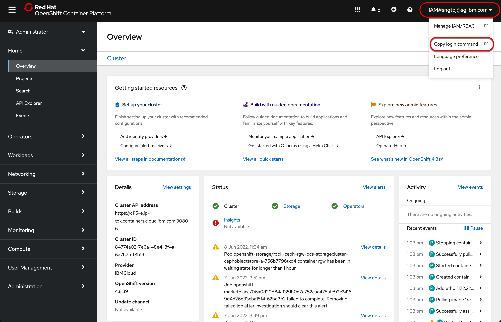
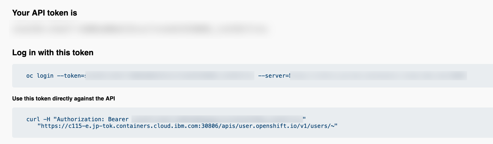

Red Hat OpenShift
#################

IBMers and partners can request for Red Hat OpenShift Kubernetes Service (ROKS) from IBM Techzone.

Reserve an instance
*******************

You can reserve an instance of OpenShift for self enablement or POC, `access <https://techzone.ibm.com/collection/custom-roks-vmware-requests>`_ to reserve your instance.

You can request custom Managed OpenShift clusters through the new self-service reservation form. Choose cluster size, flavor, and size by clicking reserve now.

    - Managed OpenShift cluster (ROKS) in IBM Cloud (“classic”) with NFS support.
    - Managed OpenShift cluster (ROKS) in IBM Cloud (VPC/"Gen2") with OCS support.

To access the link above you need to have IBMid, to create an `IBMid <https://www.ibm.com/account/reg/signup?formid=urx-19776&target=https%3A%2F%2Flogin.ibm.com%2Foidc%2Fendpoint%2Fdefault%2Fauthorize%3FqsId%3D8bdd0123-f231-42b5-9f2a-2cad9ebed217%26client_id%3DODllMDk4YzItMjgxOC00>`_.

To reserve OpenShift Instance on IBM Cloud click on **Reserve** for ROKS on classics infrastructure or VPC.

   
You can view your `reservation <https://techzone.ibm.com/my/reservations>`_ as shown below.

When you reservation is ready, an email will be sent to you with your OCP information on how you can access the cluster and also to add yourself as user to access the cluster in IBM Cloud.

You can delate your reservation as shown.

Pre-requisite
*************

You need to install and ensure you have the following

- `IBM Cloud CLI getting started <https://cloud.ibm.com/docs/cli?topic=cli-getting-started>`_
- `OpenShift CLI getting started <https://docs.openshift.com/container-platform/4.8/cli_reference/openshift_cli/getting-started-cli.html>`_

Get OpenShift login token for use with oc 
******************************************

Once you run the above ``oc login`` you will be able to use oc to managed the ocp cluster.

List projects in ocp
====================

.. code-block:: bash

   oc projects

List current project
====================

.. code-block:: bash

   oc project

List routes in current project
==============================

.. code-block:: bash

   oc get routes

List storage class
==================

.. code-block:: bash

    oc get sc

    NAME                                          PROVISIONER                             RECLAIMPOLICY   VOLUMEBINDINGMODE      ALLOWVOLUMEEXPANSION   AGE
    ibmc-vpc-block-10iops-tier (default)          vpc.block.csi.ibm.io                    Delete          Immediate              true                   2d5h
    ibmc-vpc-block-5iops-tier                     vpc.block.csi.ibm.io                    Delete          Immediate              true                   2d5h
    ibmc-vpc-block-custom                         vpc.block.csi.ibm.io                    Delete          Immediate              true                   2d5h
    ibmc-vpc-block-general-purpose                vpc.block.csi.ibm.io                    Delete          Immediate              true                   2d5h
    ibmc-vpc-block-metro-10iops-tier              vpc.block.csi.ibm.io                    Delete          WaitForFirstConsumer   true                   2d5h
    ibmc-vpc-block-metro-5iops-tier               vpc.block.csi.ibm.io                    Delete          WaitForFirstConsumer   true                   2d5h
    ibmc-vpc-block-metro-custom                   vpc.block.csi.ibm.io                    Delete          WaitForFirstConsumer   true                   2d5h
    ibmc-vpc-block-metro-general-purpose          vpc.block.csi.ibm.io                    Delete          WaitForFirstConsumer   true                   2d5h
    ibmc-vpc-block-metro-retain-10iops-tier       vpc.block.csi.ibm.io                    Retain          WaitForFirstConsumer   true                   2d5h
    ibmc-vpc-block-metro-retain-5iops-tier        vpc.block.csi.ibm.io                    Retain          WaitForFirstConsumer   true                   2d5h
    ibmc-vpc-block-metro-retain-custom            vpc.block.csi.ibm.io                    Retain          WaitForFirstConsumer   true                   2d5h
    ibmc-vpc-block-metro-retain-general-purpose   vpc.block.csi.ibm.io                    Retain          WaitForFirstConsumer   true                   2d5h
    ibmc-vpc-block-retain-10iops-tier             vpc.block.csi.ibm.io                    Retain          Immediate              true                   2d5h
    ibmc-vpc-block-retain-5iops-tier              vpc.block.csi.ibm.io                    Retain          Immediate              true                   2d5h
    ibmc-vpc-block-retain-custom                  vpc.block.csi.ibm.io                    Retain          Immediate              true                   2d5h
    ibmc-vpc-block-retain-general-purpose         vpc.block.csi.ibm.io                    Retain          Immediate              true                   2d5h
    ibmc-vpcblock-odf-10iops                      vpc.block.csi.ibm.io                    Delete          WaitForFirstConsumer   true                   2d5h
    ibmc-vpcblock-odf-5iops                       vpc.block.csi.ibm.io                    Delete          WaitForFirstConsumer   true                   2d5h
    ibmc-vpcblock-odf-custom                      vpc.block.csi.ibm.io                    Delete          WaitForFirstConsumer   true                   2d5h
    ibmc-vpcblock-odf-general                     vpc.block.csi.ibm.io                    Delete          WaitForFirstConsumer   true                   2d5h
    ibmc-vpcblock-odf-ret-10iops                  vpc.block.csi.ibm.io                    Retain          WaitForFirstConsumer   true                   2d5h
    ibmc-vpcblock-odf-ret-5iops                   vpc.block.csi.ibm.io                    Retain          WaitForFirstConsumer   true                   2d5h
    ibmc-vpcblock-odf-ret-custom                  vpc.block.csi.ibm.io                    Retain          WaitForFirstConsumer   true                   2d5h
    ibmc-vpcblock-odf-ret-general                 vpc.block.csi.ibm.io                    Retain          WaitForFirstConsumer   true                   2d5h
    ocs-storagecluster-ceph-rbd                   openshift-storage.rbd.csi.ceph.com      Delete          Immediate              true                   2d5h
    ocs-storagecluster-ceph-rgw                   openshift-storage.ceph.rook.io/bucket   Delete          Immediate              false                  2d5h
    ocs-storagecluster-cephfs                     openshift-storage.cephfs.csi.ceph.com   Delete          Immediate              true                   2d5h
    openshift-storage.noobaa.io                   openshift-storage.noobaa.io/obc         Delete          Immediate              false                  2d5h

List PVC
========

.. code-block:: bash

    oc get pvc

    NAME                                  STATUS   VOLUME                                     CAPACITY   ACCESS MODES   STORAGECLASS                 AGE
    pvc-etc-splunk-example-standalone-0   Bound    pvc-7342f36a-d12b-494d-9e5c-cd53b2ab4cb1   10Gi       RWO            ibmc-vpc-block-10iops-tier   69m
    pvc-var-splunk-example-standalone-0   Bound    pvc-b9da3d79-bee9-48cf-928b-87d5105373db   100Gi      RWO            ibmc-vpc-block-10iops-tier   69m

List ReplicaSets
================

.. code-block:: bash

   oc get ReplicaSets

    NAME                         DESIRED   CURRENT   READY   AGE
    splunk-operator-7464457cd6   1         1         1       70m

   
List services
=============

.. code-block:: bash

    oc get services

    NAME                                 TYPE        CLUSTER-IP   EXTERNAL-IP   PORT(S)                                                            AGE
    splunk-example-standalone-headless   ClusterIP   None         <none>        8000/TCP,8088/TCP,8089/TCP,9000/TCP,9997/TCP,17000/TCP,19000/TCP   68m

List configmaps
===============

.. code-block:: bash

   oc get configmaps

    NAME                       DATA   AGE
    kube-root-ca.crt           1      70m
    openshift-service-ca.crt   1      70m
    splunk-operator-lock       0      69m

List Deployment
===============

.. code-block:: bash
    
    oc get deployments

    NAME              READY   UP-TO-DATE   AVAILABLE   AGE
    splunk-operator   1/1     1            1           68m

List secrets
============

.. code-block:: bash
    
    oc get secrets

    NAME                                TYPE                                  DATA   AGE
    builder-dockercfg-8sxcw             kubernetes.io/dockercfg               1      66m
    builder-token-7w72r                 kubernetes.io/service-account-token   4      66m
    builder-token-ngh6d                 kubernetes.io/service-account-token   4      66m
    default-dockercfg-v5b5s             kubernetes.io/dockercfg               1      66m
    default-token-dbxvc                 kubernetes.io/service-account-token   4      66m
    default-token-rrkwd                 kubernetes.io/service-account-token   4      66m
    deployer-dockercfg-cr4x4            kubernetes.io/dockercfg               1      66m
    deployer-token-bvm9p                kubernetes.io/service-account-token   4      66m
    deployer-token-kp9jj                kubernetes.io/service-account-token   4      66m
    splunk-example-standalone-secrets   Opaque                                6      63m
    splunk-operator-dockercfg-hkwdz     kubernetes.io/dockercfg               1      66m
    splunk-operator-token-bhtlb         kubernetes.io/service-account-token   4      66m
    splunk-operator-token-j5xgp         kubernetes.io/service-account-token   4      66m

List pods
=========

.. code-block:: bash

    oc get pods

    NAME                               READY   STATUS    RESTARTS   AGE
    splunk-example-standalone-0        1/1     Running   0          61m
    splunk-operator-7464457cd6-9sqw9   1/1     Running   0          64m

   

Resources
*********

- get started with `OpenShift on IBM Cloud <https://cloud.ibm.com/docs/openshift?topic=openshift-getting-started>`_