Splunk
######

The following provides guidance in setting splunk on OpenShift using the community splunk-operator.

Prerequisite 

- install ibmcloud cli
- openshift cli
- kubectl cli

Deploy Splunk Operator
**********************

login to OpenShift
==================

get OpenShift login credential

from a terminal, login to openshift

create project
==============

You can create the project in advance and choose the created project when you install the splunk-operator. Alternatively, you can also create project aka namesapce during installatin of splunk-operator.

.. code-block:: bash
    
    oc new-project splunk-operator

create splunk-operator namespace aka project

install the operator
====================

install the operator using openshift UI

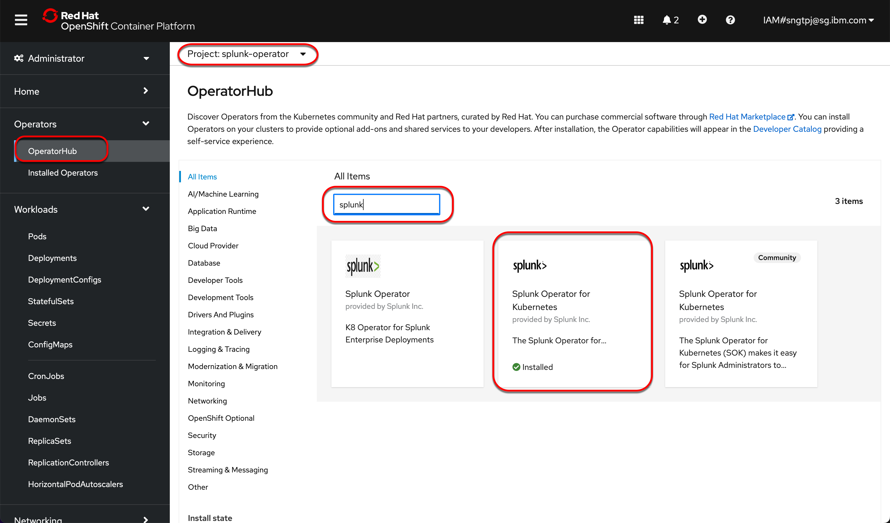
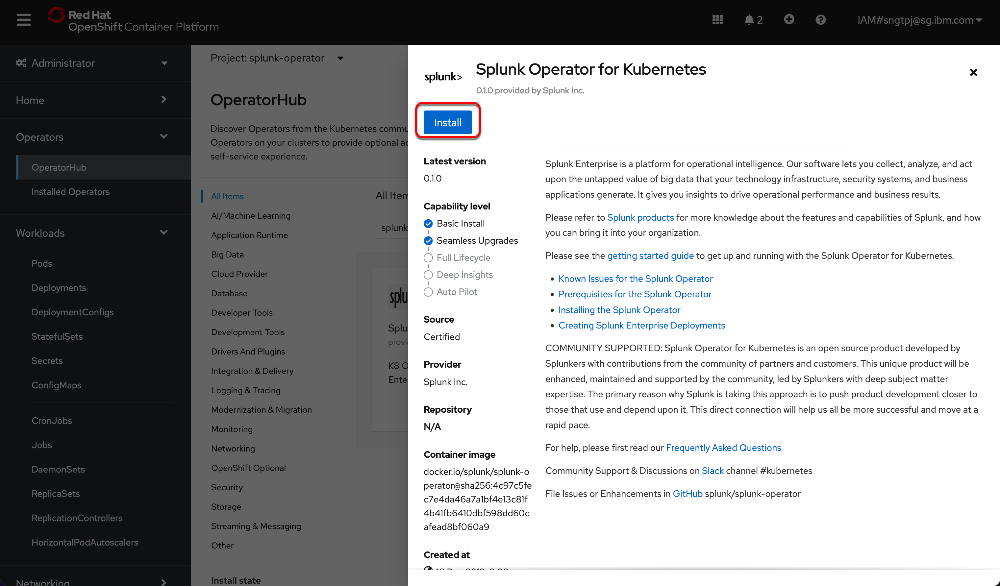
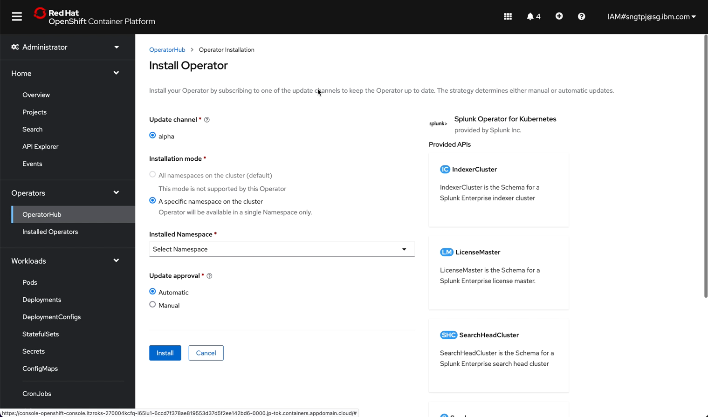
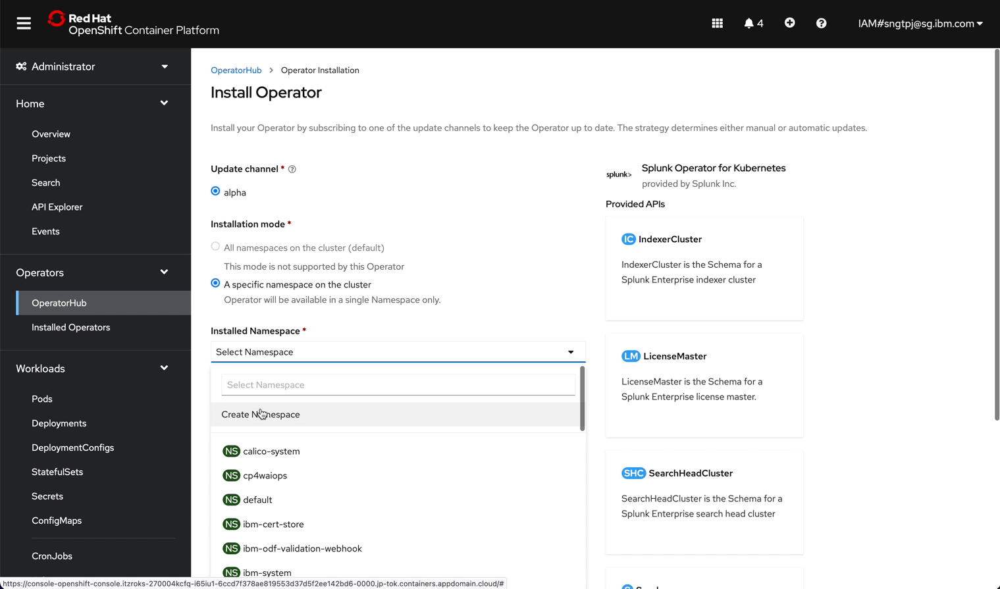
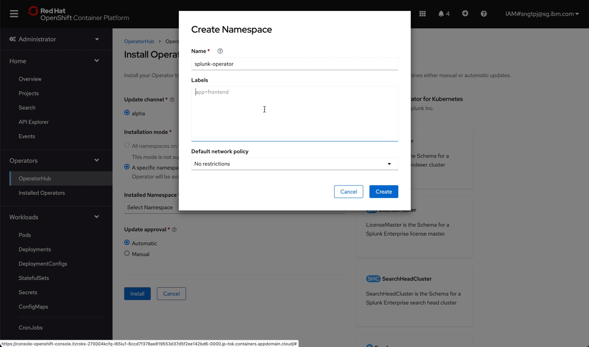
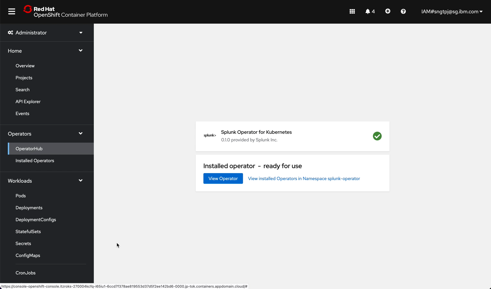
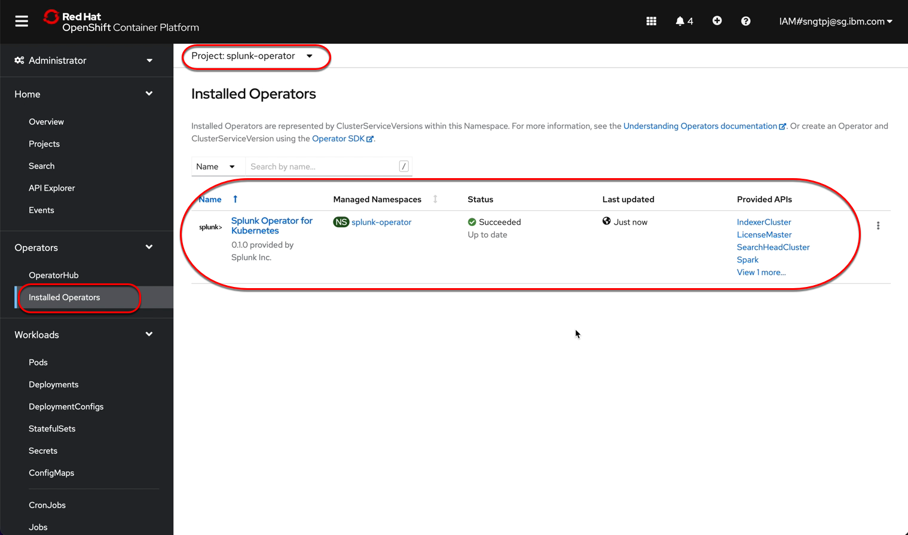
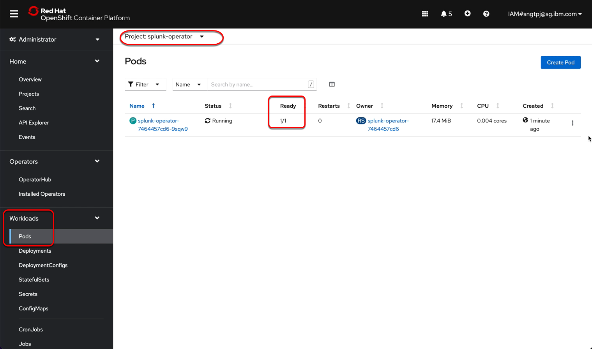

Deploy Splunk Enterprise Standalone 
************************************

install the standalone splunk server

Deploy Splunk standalone
========================

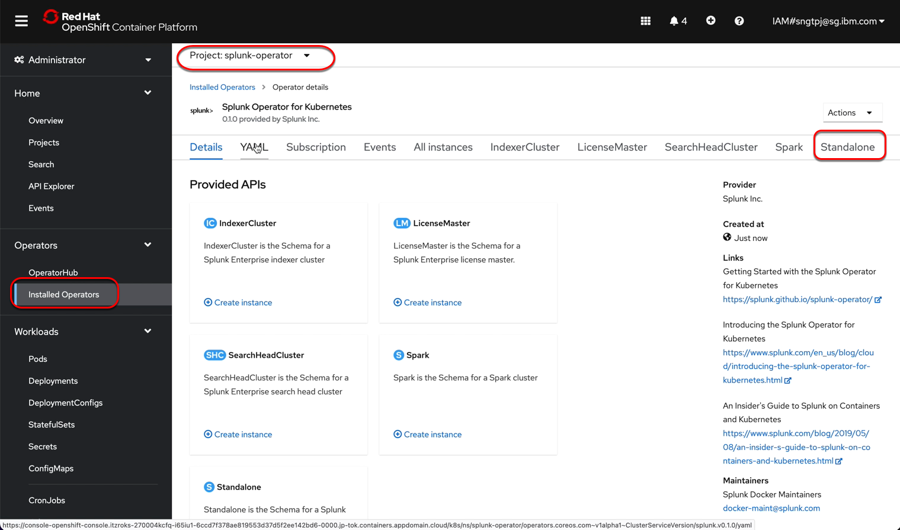
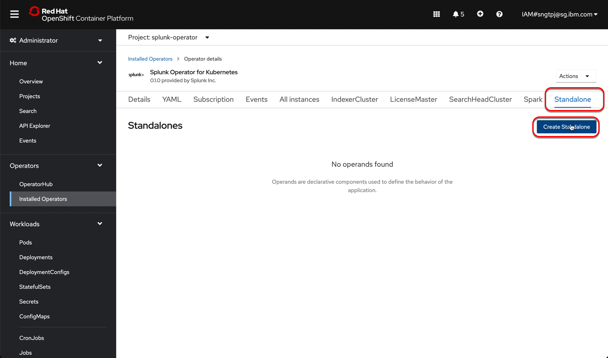
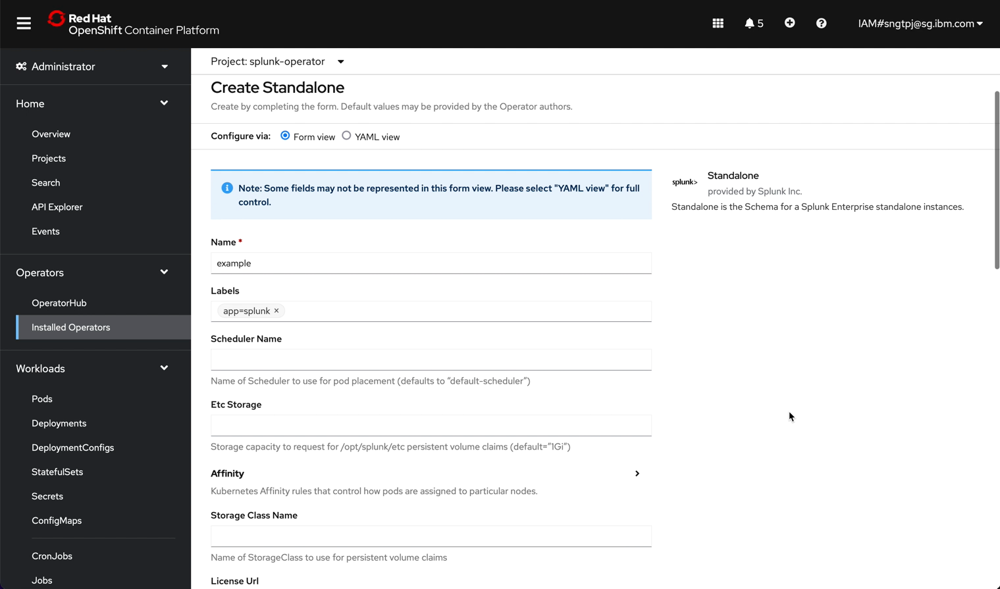
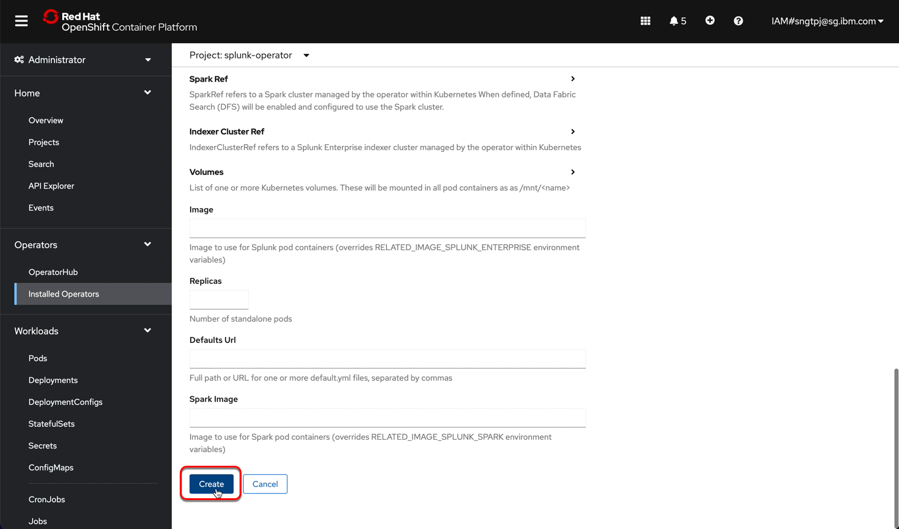
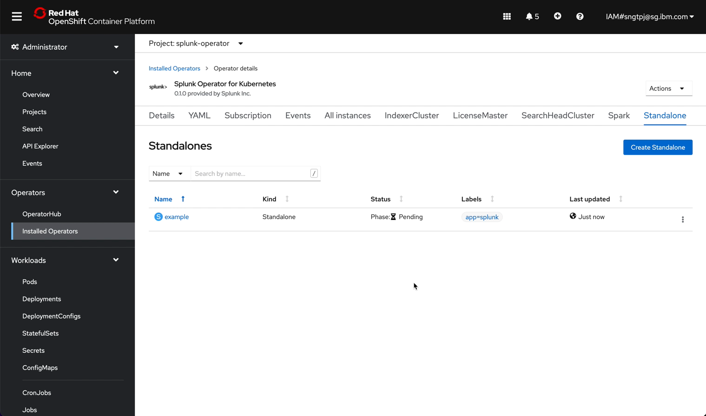
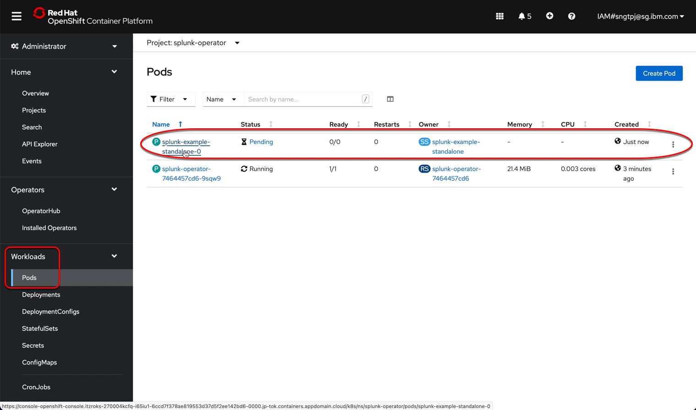
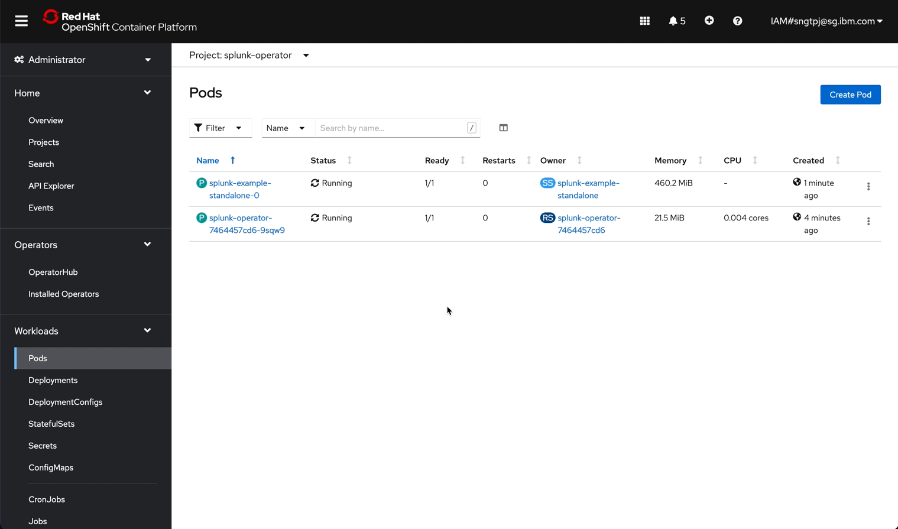

* get password for splunk web
* quick local test splunk web
* configure splunk

  - enable SSH
  - add user
  - set preference
  - restart server
  
* create route for splunk web
* create route for splunk api

Test drive splunk
*****************

Configure Splunk
================

Splunk preferences (Optional)
-----------------------------

SPL Editor

Server settings
---------------

General settings

Users (Optional)
----------------

Add user

Add data
========

Search data
===========
